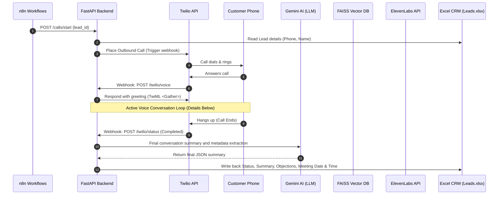
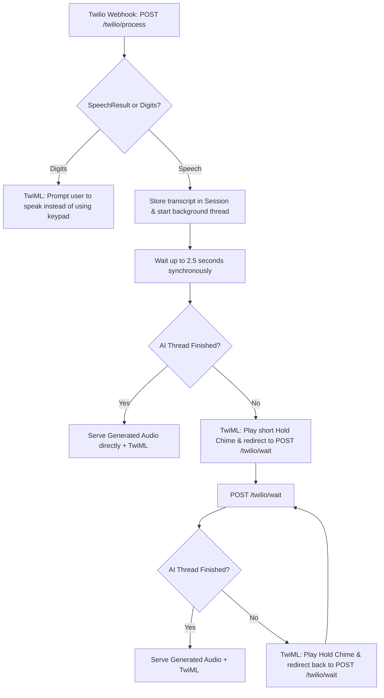
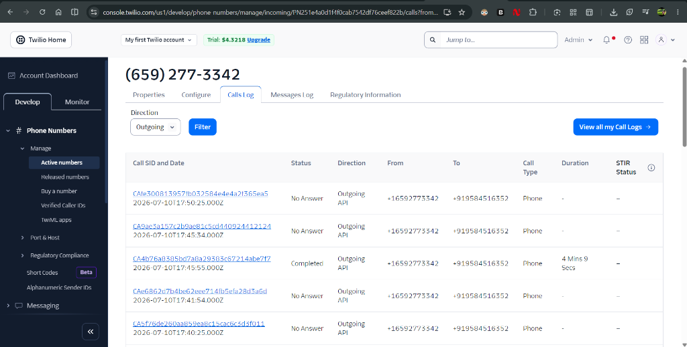
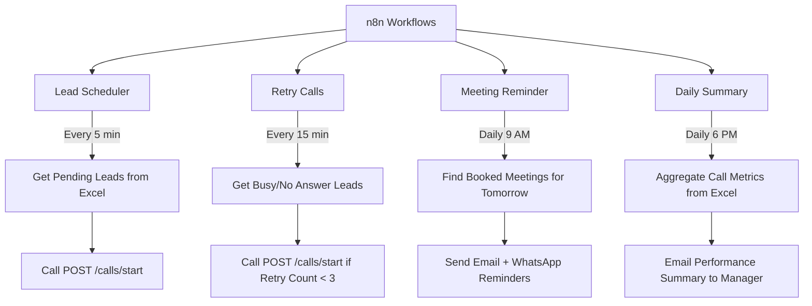
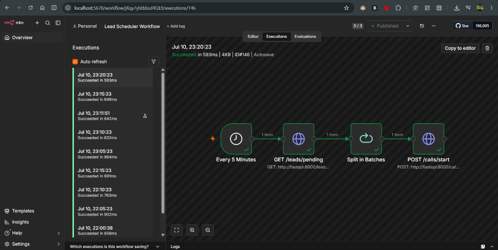
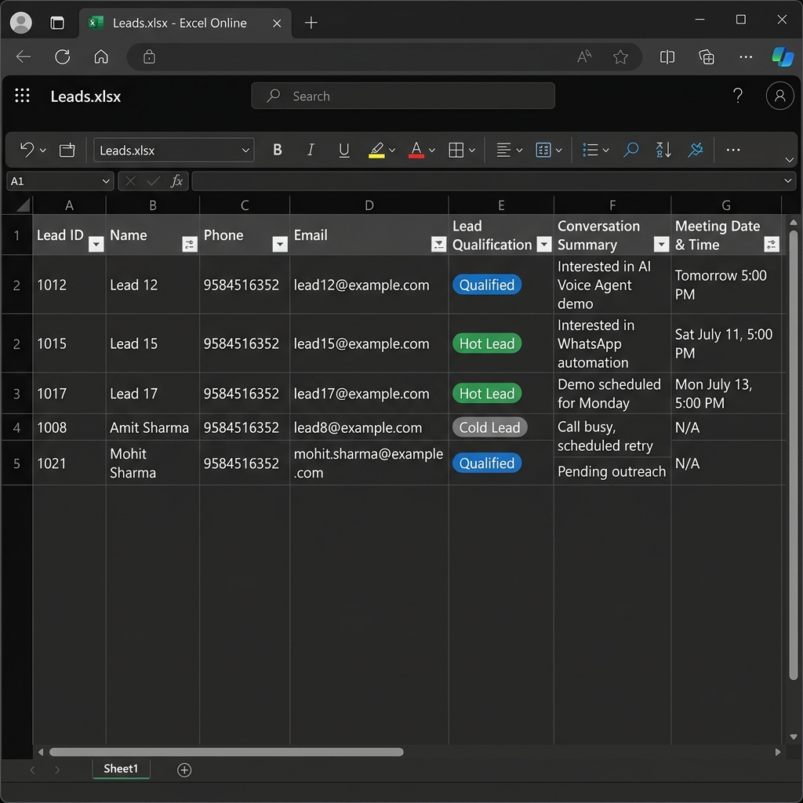
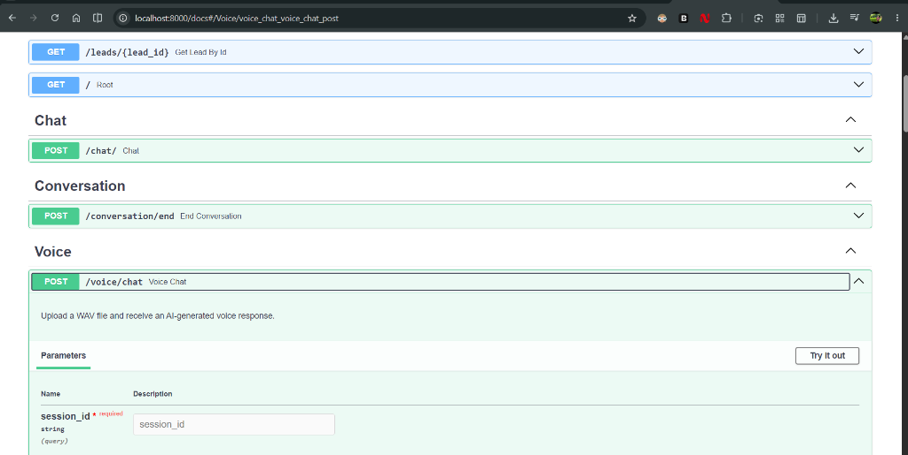

# AI Voice Sales Agent (Excel CRM)


<p align="center">
  <b>AI-powered Voice Sales Agent using FastAPI, Twilio, Gemini, Whisper, ElevenLabs, FAISS, Docker and n8n that automatically calls leads, qualifies customers, books meetings and updates CRM in real time.</b>
</p>

<p align="center">
  
</p>

<p align="center">
  <a href="https://python.org"></a>
  <a href="https://fastapi.tiangolo.com"></a>
  <a href="https://docker.com"></a>
  <a href="https://twilio.com"></a>
  <a href="https://n8n.io"></a>
  <a href="https://deepmind.google/technologies/gemini"></a>
  <a href="https://elevenlabs.io"></a>
  <a href="https://opensource.org/licenses/MIT"></a>
  <a href="https://github.com/Ashish6312/ai-voice-sales-agent/stargazers"></a>
</p>

---

## 🎥 Live Demo

[](https://www.youtube.com/watch?v=fjXRKDE958g&t=2s)
*(Click above to watch the AI Voice Sales Agent in action handling lead qualification and scheduling!)*

---

## System Architecture

```
┌──────────────────────────────────────────────────────────────────┐
│                          n8n Scheduler                           │
│   Every 5 min: Lead Scheduler → calls new/pending leads          │
│   Every 15 min: Retry Calls → re-dials busy/no-answer leads      │
│   Daily 9 AM:  Meeting Reminder → Email + WhatsApp reminders     │
│   Daily 6 PM:  Daily Summary → Performance report email          │
└───────────────────────────┬──────────────────────────────────────┘
                            │ POST /calls/start
                            ▼
                  ┌──────────────────┐
                  │  FastAPI Backend │
                  │  Looks up lead   │
                  │  Formats phone   │
                  │  Calls Twilio    │
                  └────────┬─────────┘
                           │ Twilio dials customer
                           ▼
              ┌────────────────────────┐
              │   Customer Phone Rings │
              │   Customer Answers     │
              └────────────┬───────────┘
                           │ Webhook: POST /twilio/voice
                           ▼
                  ┌──────────────────┐
                  │  AI Conversation │
                  │  Whisper (STT)   │  ← hears customer
                  │  Gemini LLM      │  ← generates reply
                  │  ElevenLabs TTS  │  ← speaks reply
                  └────────┬─────────┘
                           │ Webhook: POST /twilio/status
                           ▼
                  ┌──────────────────┐
                  │  Excel CRM Sync  │  data/Leads.xlsx
                  │  Call Status     │  → Completed
                  │  Last Call SID   │  → CAxxxxxxxx
                  │  Retry Count     │  → updated
                  └──────────────────┘
```

### Visual Life-Cycle & Call Loop Diagrams

#### Outbound Call Lifecycle Sequence
This sequence diagram shows the step-by-step API coordination when an outbound lead call is initiated, processed, and written back to the Excel CRM.



#### Webhook Loop & Timeout Prevention Flow
Twilio requires webhooks to respond within 15 seconds. High-latency speech processing (Whisper STT + Gemini LLM + ElevenLabs TTS generation) can easily exceed this limit. To prevent timeouts, this project implements a hybrid synchronous/asynchronous wait pool:



---

## Twilio Operations Dashboard
The backend connects directly with the Twilio Voice API infrastructure to route calls globally. Here is a visualization of the active calls and monitoring panels:

<p align="center">
  
</p>

---

## Tech Stack

| Component | Technology | Role |
|-----------|------------|------|
| **API Server** | FastAPI (Python) | Core backend, webhooks, and routing |
| **Language Model** | Gemini 2.5 Flash | Handles the conversation flow and parses customer details |
| **Speech-to-Text** | Faster-Whisper | Transcribes customer speech locally |
| **Text-to-Speech** | ElevenLabs API | Generates the voice response |
| **Phone Carrier** | Twilio Voice API | Places calls and handles TwiML webhooks |
| **Automation** | n8n | Runs schedules to dial leads, send reminders, and compile reports |
| **CRM** | Excel (Pandas + OpenPyXL) | Stores lead data |
| **Tunnel** | ngrok | Exposes the local server to Twilio webhooks |
| **Containers** | Docker Compose | Runs FastAPI and n8n in separate containers |
| **Knowledge Base** | FAISS + Embeddings | Retrieves company details to answer questions |

---

## Project Structure

```
AI_Voice_Agent/
│
├── app/
│   ├── api/
│   │   ├── calls.py           # POST /calls/start — triggers outbound Twilio calls
│   │   ├── notifications.py   # POST /notifications/email & /whatsapp — n8n alerts
│   │   ├── leads.py           # GET /leads, /leads/pending — CRM read endpoints
│   │   ├── twilio.py          # POST /twilio/voice, /process, /status — call webhooks
│   │   ├── voice.py           # GET /voice/audio — audio file serving
│   │   ├── chat.py            # POST /chat — text-based chat interface
│   │   ├── conversation.py    # POST /conversation/end — session finalization
│   │   └── health.py          # GET /health — system health check
│   │
│   ├── services/
│   │   ├── ai_service.py          # Gemini client, structured JSON prompts
│   │   ├── crm_service.py         # Excel Pandas CRM read/write
│   │   ├── excel_service.py       # Low-level OpenPyXL Excel operations
│   │   ├── twilio_service.py      # Outbound call placement via Twilio SDK
│   │   ├── session_manager.py     # In-memory session persistence
│   │   ├── stt_service.py         # Faster-Whisper model loader
│   │   ├── conversation_service.py # RAG pipeline + chat state
│   │   ├── knowledge_service.py   # FAISS embedding search
│   │   ├── sales_agent.py         # AI sales executive logic
│   │   └── voice/
│   │       ├── elevenlabs_tts.py  # ElevenLabs TTS integration
│   │       ├── tts_factory.py     # TTS provider factory
│   │       ├── voice_service.py   # Audio loop orchestration
│   │       └── base_tts.py        # Abstract TTS base class
│   │
│   ├── core/
│   │   └── config.py          # Settings and .env validation
│   │
│   ├── knowledge/
│   │   ├── knowledge.txt      # Company/product knowledge for RAG
│   │   ├── faiss.index        # FAISS vector index
│   │   └── metadata.pkl       # Embedding metadata
│   │
│   └── main.py                # FastAPI app entry point + router registration
│
├── n8n/
│   ├── lead_scheduler.json    # Every 5 min: calls new/pending leads
│   ├── retry_calls.json       # Every 15 min: retries failed/no-answer leads
│   ├── meeting_reminder.json  # Daily 9 AM: email + WhatsApp meeting reminders
│   └── daily_summary.json     # Daily 6 PM: aggregated performance report
│
├── data/
│   └── Leads.xlsx             # Excel CRM — all lead data
│
├── audio/
│   ├── input/                 # STT source audio uploads
│   └── output/                # ElevenLabs-generated TTS MP3 files
│
├── docker-compose.yml         # FastAPI + n8n Docker services
│   ├── Dockerfile             # FastAPI container build
│   ├── requirements.txt       # Python dependencies
│   ├── .env                   # Environment variables (secrets)
│   └── AI_Voice_Agent.exe     # Standalone manual launcher (Docker-based)
```

---

## Quick Start (Manual Host Setup - Without Docker/EXE)

### Prerequisites
1. **Python 3.12** installed on your host machine.
2. **Node.js & npm** installed (to run n8n on host, or use the n8n Desktop App).
3. **ngrok CLI** installed on your host machine.
4. A Twilio account with a phone number, ElevenLabs account, and Gemini API key.

### 1. Configuration
Copy and fill out the `.env` file in the project root:

```ini
GEMINI_API_KEY=your_gemini_api_key
ELEVENLABS_API_KEY=your_elevenlabs_api_key
ELEVENLABS_VOICE_ID=your_voice_id
TWILIO_ACCOUNT_SID=ACxxxxxxxxxxxxxxxxxx
TWILIO_AUTH_TOKEN=your_auth_token
TWILIO_PHONE_NUMBER=+1xxxxxxxxxx
PUBLIC_BASE_URL=https://your-ngrok-domain.ngrok-free.app
EXCEL_FILE=data/Leads.xlsx
```

### 2. Start Services Manually

To run the application, open **three separate terminals** in the project directory:

#### Terminal 1: FastAPI Backend
Activate the virtual environment and start the Uvicorn server:
```cmd
# Activate python virtual environment
.venv\Scripts\activate

# Launch the FastAPI app
uvicorn app.main:app --host 127.0.0.1 --port 8000
```
*Note: Once local n8n is running (in Terminal 2), the FastAPI server will automatically connect to it on startup to sync workflows and apply dropdown data validations to [Leads.xlsx](file:///e:/AI_Voice_Agent/data/Leads.xlsx).*

#### Terminal 2: n8n Workflow Engine
If n8n is installed via npm, start the local instance:
```cmd
n8n start
```
*(If you are using the n8n Desktop App, you can simply open it from your Windows application list).*

#### Terminal 3: ngrok Tunnel
Expose the FastAPI backend (port 8000) using ngrok:
```cmd
ngrok http --url=your-registered-domain.ngrok-free.dev 8000
```

### 3. Verify Connections

| Service | Address |
|---------|-----|
| FastAPI Root | http://localhost:8000 |
| Swagger API Docs | http://localhost:8000/docs |
| API Health | http://localhost:8000/health |
| n8n Dashboard | http://localhost:5678 |
| Excel CRM leads | http://localhost:8000/leads |

---

## n8n Automation Workflows



<p align="center">
  
</p>

*   **Lead Scheduler (`Every 5 minutes`):** Fetches `New/Pending` leads from Excel and sends a POST request to `/calls/start`.
*   **Retry Calls (`Every 15 minutes`):** Re-dials leads marked `No Answer` or `Busy` if they have been called fewer than 3 times.
*   **Meeting Reminder (`Daily at 9 AM`):** Finds leads with a meeting booked tomorrow and logs an email/WhatsApp reminder request.
*   **Daily Summary (`Daily at 6 PM`):** Compiles metrics from the Excel sheet and emails a daily performance summary to the manager.

---

## Call Flow & Live Demonstration

### Outbound Call Orchestration
1. **n8n triggers** `POST /calls/start` with a `lead_id`.
2. **FastAPI** reads the customer phone number from [Leads.xlsx](file:///e:/AI_Voice_Agent/data/Leads.xlsx) and formats it to the international E.164 standard.
3. **Twilio** dials the lead.
4. **When the lead answers**, Twilio hits the `POST /twilio/voice` webhook to get the initial call instructions.
5. **FastAPI plays the greeting** generated via ElevenLabs TTS.
6. **Conversation loop**:
    *   Customer talks → Twilio sends the text transcription to `/twilio/process`.
    *   Gemini handles the conversation, fetches knowledge-base details (RAG) when asked company questions, and extracts meeting or qualification info.
    *   ElevenLabs generates the voice response → Twilio plays it back to the customer.
7. **Call ends** → Twilio hits `/twilio/status` webhook.
8. **Excel CRM updates** with Call Status, Conversation Summary, Objections, Meeting Date & Time, and the timestamp.

### Sample Conversation Transcript

A sample conversation transcript from a successful call session.

*   **AI (Ashish):** "Hello Alice, this is Ashish from AI Solutions. How can I help you today?"
*   **Customer (Alice):** "Hi. I saw your ad about automated sales agents. How much does it cost?"
*   **AI (Ashish):** "Our pricing starts at $49 a month for the starter tier, which includes basic automated outbound dialing, and goes up to $299 a month for the enterprise tier which includes full CRM integration, customized voice cloning, and retrieval-augmented generation for your custom knowledge base. May I ask what specific features you are looking for?" *(RAG retrieval for company pricing details)*
*   **Customer (Alice):** "We need custom API integration and it must support our own knowledge base because our product is quite technical."
*   **AI (Ashish):** "Understood, Alice. The enterprise tier perfectly fits your needs as it includes custom API access and dedicated vector database configuration. Would you like to schedule a 15-minute demo with our sales executive tomorrow to walk through how this works?"
*   **Customer (Alice):** "Tomorrow is tight. Can we do Monday at 2 PM IST?"
*   **AI (Ashish):** "I can book Monday at 2 PM IST for you. Let me secure that slot. I've sent a calendar invite to your email. Is there anything else I can help you with today?" *(Meeting date extraction: Monday 2 PM)*
*   **Customer (Alice):** "No, that's all. Thank you."
*   **AI (Ashish):** "Fantastic, Alice! Have a great day and we look forward to speaking on Monday. Goodbye!"
*   **Customer (Alice):** "Bye."
*   *(Call ends, session is marked completed, and CRM updates with Hot qualification, summary, objection info, and meeting date/time).*

---

## Excel CRM State Representation

The CRM writes back all variables from the conversation structure directly.

<p align="center">
  
</p>

### Before Call State:
| Lead ID | Name | Company | Phone | Email | Status | Call Status | Retry Count | Meeting Date & Time |
| :--- | :--- | :--- | :--- | :--- | :--- | :--- | :--- | :--- |
| 1001 | Alice Smith | Acme Corp | +15550199 | alice@acme.com | New | Pending | 0 | - |

### After Call State (Successful Qualification & Booking):
| Column | Value / State |
| :--- | :--- |
| **Lead ID** | 1001 |
| **Name** | Alice Smith |
| **Company** | Acme Corp |
| **Status** | Contacted |
| **Call Status** | Completed |
| **Retry Count** | 0 |
| **Lead Qualification** | Hot |
| **Conversation Summary** | Alice requested custom API access and vector database capability. Booked a product demo. |
| **Customer Requirements** | Custom API access, company knowledge integration. |
| **Objections Raised** | Data privacy and custom vector indexing. |
| **Meeting Date & Time** | 2026-07-13 14:00:00 (Monday, 2 PM IST) |
| **Last Contacted Timestamp**| 2026-07-11 10:45:12 |

---

## Production Considerations & Solutions

While Excel and in-memory architectures are highly efficient for prototypes and local development, scaling to enterprise production requires addressing several limitations:

### 1. Concurrent Write Limitations (Excel vs. PostgreSQL)
*   **The Issue:** Excel (`Leads.xlsx`) is file-based and does not support concurrent write locks. If multiple outbound calls complete at the same time, simultaneous write requests from `/twilio/status` will result in file access conflicts (`PermissionError` on Windows) or silent data overwrites.
*   **The Production Fix:** Replace [crm_service.py](file:///e:/AI_Voice_Agent/app/services/crm_service.py) with a relational database like **PostgreSQL** using an ORM like **SQLAlchemy**. This enables connection pooling, transactional integrity (ACID), and row-level locking (`SELECT ... FOR UPDATE`), preventing race conditions.

### 2. Distributed Session Storage (Redis)
*   **The Issue:** Currently, [session_manager.py](file:///e:/AI_Voice_Agent/app/services/session_manager.py) stores call history and metadata in-memory using a Singleton pattern. If the FastAPI server restarts, all active call sessions, transcription states, and Gemini contexts are lost. Furthermore, this prevents scaling the backend horizontally across multiple server instances.
*   **The Production Fix:** Move session data to a **Redis** instance. Redis supports high-speed key-value reads/writes, TTL (Time-To-Live) expiration of expired sessions, and allows multiple FastAPI instances behind a load balancer to access a single, shared session state.
*   > **💡 Interview Tip:** During interviews, when asked about session persistence, explain: *"For simplicity, I used an in-memory session manager in the prototype. In production, I'd replace it with Redis so multiple FastAPI instances can share conversation state."*

### 3. API Authentication & Security
*   **The Issue:** Core endpoints like `POST /calls/start` and webhook URLs are exposed publicly without credentials, allowing unauthorized callers to trigger outbound calls and manipulate CRM states.
*   **The Production Fix:**
    *   **Internal Routes:** Protect `POST /calls/start` and `/leads` using **API Keys** or **OAuth2/JWT** headers.
    *   **Twilio Webhooks:** Implement Twilio signature validation using the Twilio SDK `RequestValidator` to reject requests that do not originate from Twilio's official IPs.

### 4. Structured Logging & Traceability
*   **The Issue:** Standard print statements are insufficient for diagnosing production bugs or tracing a caller's journey through multi-turn steps.
*   **The Production Fix:** Implement a structured JSON logger (e.g., `structlog` or standard Python `logging` with JSON formatters). Assign a unique **Trace/Correlation ID** to each call session and propagate it across all logs, including Twilio webhooks, STT processing, LLM generation, and TTS synthesis.

### 5. Monitoring & Metrics
*   **The Issue:** Lack of visibility into API latency, conversion rates, call failure rates, and model cost analysis.
*   **The Production Fix:** Expose a `/metrics` endpoint to be scraped by **Prometheus** and visualized in **Grafana**. Track indicators such as:
    *   Total calls placed vs. completed (Call volume & status).
    *   Average call duration.
    *   Speech-to-Text, LLM, and TTS generation latency.
    *   Gemini API token usage and ElevenLabs cost trackers.
    *   Meeting conversion rate (Leads qualified "Hot" with booked meetings).

---

## Interactive Swagger UI Route Docs & JSON Schema

Below is the OpenAPI layout exposed at `/docs`.

<p align="center">
  
</p>

```
┌────────────────────────────────────────────────────────┐
│  GET     /health                              [Health]  │ -> Check server & Faster-Whisper status
│  GET     /leads                               [Leads]   │ -> Read all leads from Excel CRM
│  GET     /leads/pending                       [Leads]   │ -> Fetch pending leads for scheduling
│  POST    /calls/start                         [Calls]   │ -> Initiate an outbound call for lead_id
│  POST    /twilio/voice                        [Twilio]  │ -> Handle incoming/answering call webhook
│  POST    /twilio/process                      [Twilio]  │ -> Process customer speech response
│  POST    /twilio/wait                         [Twilio]  │ -> Poll for background AI response
│  POST    /twilio/status                       [Twilio]  │ -> Receive call outcome & save summary
│  POST    /twilio/resume                       [Twilio]  │ -> Handle holding when hitting Gemini quota
│  POST    /notifications/email                 [Alerts]  │ -> Send email notification
│  POST    /notifications/whatsapp              [Alerts]  │ -> Send WhatsApp notification
└────────────────────────────────────────────────────────┘
```

#### JSON Request Schema for Outbound Calls (`POST /calls/start`):
```json
{
  "lead_id": 1001
}
```

#### JSON Response Schema for Health Check (`GET /health`):
```json
{
  "status": "healthy",
  "whisper_model_loaded": true,
  "crm_connected": true,
  "timestamp": "2026-07-11T10:41:07.123456"
}
```

---

## Interview Q&A (Architectural Deep Dive)

Be prepared to answer these technical architectural questions during evaluations:

### 1. Why FastAPI instead of Flask?
*   **Asynchronous Support:** FastAPI is built on Starlette and supports ASGI. It handles concurrent I/O operations natively via Python's `async/await`, which is crucial for handling multiple concurrent Twilio webhook callbacks. Flask is traditionally WSGI-based and blocks execution unless wrapped in complex thread pools.
*   **Data Validation:** FastAPI integrates natively with Pydantic. It automatically parses, validates, and serializes request bodies and query parameters, throwing clear HTTP 422 errors for malformed requests without requiring manual validation code.
*   **OpenAPI Documentation:** It automatically generates interactive Swagger UI (`/docs`) and ReDoc (`/redoc`) API schemas directly from function signatures and type hints, saving significant documentation overhead.

### 2. Why Twilio?
*   **Industry Standard:** Twilio has highly reliable telecommunication rails, global phone number provisioning, and a robust SLA.
*   **TwiML XML Framework:** Twilio uses TwiML (an XML schema) for call flow instructions. Twilio's standard `<Gather>` verb makes it easy to capture user speech or keypresses and POST them back to our server, handling voice processing loops cleanly.

### 3. Why Faster-Whisper instead of Whisper API?
*   **Reduced Latency:** Offloading Speech-to-Text to the local server eliminates network round-trip overhead.
*   **Optimized Performance:** Faster-Whisper uses CTranslate2 (a fast inference engine for Transformer models) which reduces memory footprint and increases transcription speeds by up to 4x compared to OpenAI's native PyTorch Whisper codebase, running efficiently on generic CPUs.
*   **Data Privacy & Cost:** Transcribing locally keeps customer call transcripts entirely private within our network and eliminates the per-minute transcription costs of third-party APIs.

### 4. Why FAISS instead of ChromaDB?
*   **Serverless & Lightweight:** FAISS is a vector similarity search library written in C++ with Python bindings. It runs directly inside the FastAPI process, storing indexes as local binary files. This eliminates the operational overhead of running, hosting, and maintaining a separate database container like ChromaDB or Pinecone.
*   **Speed:** FAISS is highly optimized for fast L2 distance and dot-product vector search, returning semantic results in less than 2 milliseconds, which is essential to keep LLM response times low.

### 5. Why not store embeddings in PostgreSQL with PGVector?
*   **Project Simplicity:** In our current Excel-focused prototype, storing embeddings in a local FAISS index allows the backend to remain lightweight and fully self-contained.
*   **Enterprise Scaling:** In production, we *should* migrate to PGVector in PostgreSQL. It allows us to perform unified relational and vector queries in a single database, benefit from database clustering, and utilize standard backup procedures instead of serializing indices to pickle files (`metadata.pkl`).

### 6. How would you scale to 1000 simultaneous calls?
*   **Load Balancing & Horizontal Scaling:** Deploy the FastAPI backend in Docker containers across an auto-scaling AWS ECS Fargate or Kubernetes (EKS) cluster.
*   **Distributed State Cache:** Swap the in-memory singleton session manager for a centralized **Redis** cluster to share conversation states across all API workers.
*   **Database Scaling:** Migrate from Excel to a PostgreSQL instance with a connection pool manager like **PgBouncer** to handle high transaction concurrency.
*   **Speech Processing Pipelines:** Local CPU-based Whisper execution will choke under 1000 concurrent calls. We must offload Speech-to-Text to an autoscaling GPU cluster (e.g. self-hosted Whisper containers or serverless API clusters like Replicate) and stream the output.
*   **Streaming APIs:** Stream text responses using Gemini's streaming API, and stream audio chunks using ElevenLabs WebSockets to start playing audio to the user before the full response finishes generating.

### 7. How would you deploy this on AWS?
*   **FastAPI Backend:** Host inside Docker on **AWS ECS Fargate** or **AWS EKS** (Kubernetes), managed by an **Application Load Balancer (ALB)**.
*   **Database (CRM):** Use **AWS RDS PostgreSQL** with PGVector enabled.
*   **Session Cache:** Deploy **AWS ElastiCache Redis** for fast conversation history lookup.
*   **Static Voice Assets:** Save generated ElevenLabs audio files to an **AWS S3** bucket and serve them via **CloudFront** (CDN) to minimize Twilio playback latency.
*   **n8n Orchestrator:** Run n8n on a small **AWS EC2** instance or within an ECS container, connected to the RDS database.

### 8. How do you handle Twilio webhook retries?
*   **Acknowledge Immediately:** Ensure our endpoints respond to Twilio with an HTTP 200 OK immediately after validating the payload, offloading slow processing steps (like database writes and LLM calls) to background worker threads.
*   **Idempotency Keys:** Track the Twilio `CallSid` in Redis. If Twilio retries a webhook for a webhook that is already processing, immediately return the cached response rather than re-triggering AI logic.

### 9. Why use n8n instead of Celery Beat or cron?
*   **Visual Workflow Building:** n8n allows developers and non-technical stakeholders to visually inspect, edit, and debug complex scheduling flows, eliminating Python orchestration boilerplate.
*   **Pre-Built Integrations:** n8n features built-in nodes for Email (SMTP), WhatsApp, Slack, and Google Sheets, simplifying notification routing.
*   **Error Monitoring:** Offers a graphical execution history of all schedules, making it easy to identify why a retry call failed or why a summary email wasn't delivered.

### 10. How do you prevent duplicate calls to the same lead?
*   **Database Transitions:** We implement a state machine where a lead's status is updated to `Dialing` or `Calling` in a single database transaction *before* the call is placed. If the status is not `Pending`/`New`, we block additional attempts.
*   **Distributed Locks:** In distributed systems, use a Redis-based distributed lock (`Redlock`) on the `lead_id`. The n8n worker must acquire this lock before it is allowed to call `POST /calls/start`.

### 11. What happens if Gemini times out?
*   **Timeout & Retry Limits:** Wrap the Gemini API request in a client-side timeout block (e.g., 5 seconds) and catch the exception.
*   **Polite Fallbacks:** If the LLM times out or returns an error, catch the failure in the webhook handler and return a default TwiML phrase like: *"I'm sorry, I am experiencing temporary difficulties. Please hold for a second."* while redirecting back to the processing queue.
*   **Circuit Breakers:** Implement a circuit breaker pattern (e.g., using `pybreaker`) to stop making API calls to Gemini if it's down, gracefully ending the call or forwarding the customer to a human sales representative.

### 12. How would you support multiple companies with different knowledge bases?
*   **Multi-Tenancy Schema:** Include a `company_id` or `tenant_id` field in the database.
*   **Isolated Index Files:** Create and name FAISS indices dynamically (e.g., `faiss_tenant_{id}.index`).
*   **Scoped Retrieval:** When an incoming call is received, lookup the lead's company metadata first, load the corresponding FAISS index, and pass only that company's index vectors to the RAG pipeline.

---

## Troubleshooting

| Issue | Resolution |
|---------|----------|
| "Application error has occurred" during Twilio call | Check that ngrok is running and that `PUBLIC_BASE_URL` matches your active ngrok URL. |
| "Unverified number" Twilio error | Twilio trial accounts can only place calls to phone numbers you have verified in the Twilio Console. |
| n8n login fails | The setup script running inside the FastAPI process handles login. Make sure n8n is running at the configured address. |
| Workflows missing in n8n | Restart your FastAPI backend server. It automatically registers and syncs the n8n workflows on startup. |
| Excel fails to update | Close `data/Leads.xlsx` if you have it open on your desktop (prevents Excel file lock conflicts). |

---

## License

This project is licensed under the MIT License. See below for details:

```
MIT License

Copyright (c) 2026 Ashish Sharma

Permission is hereby granted, free of charge, to any person obtaining a copy
of this software and associated documentation files (the "Software"), to deal
in the Software without restriction, including without limitation the rights
to use, copy, modify, merge, publish, distribute, sublicense, and/or sell
copies of the Software, and to permit persons to whom the Software is
furnished to do so, subject to the following conditions:

The above copyright notice and this permission notice shall be included in all
copies or substantial portions of the Software.

THE SOFTWARE IS PROVIDED "AS IS", WITHOUT WARRANTY OF ANY KIND, EXPRESS OR
IMPLIED, INCLUDING BUT NOT LIMITED TO THE WARRANTIES OF MERCHANTABILITY,
FITNESS FOR A PARTICULAR PURPOSE AND NONINFRINGEMENT. IN NO EVENT SHALL THE
AUTHORS OR COPYRIGHT HOLDERS BE LIABLE FOR ANY CLAIM, DAMAGES OR OTHER
LIABILITY, WHETHER IN AN ACTION OF CONTRACT, TORT OR OTHERWISE, ARISING FROM,
OUT OF OR IN CONNECTION WITH THE SOFTWARE OR THE USE OR OTHER DEALINGS IN THE
SOFTWARE.
```